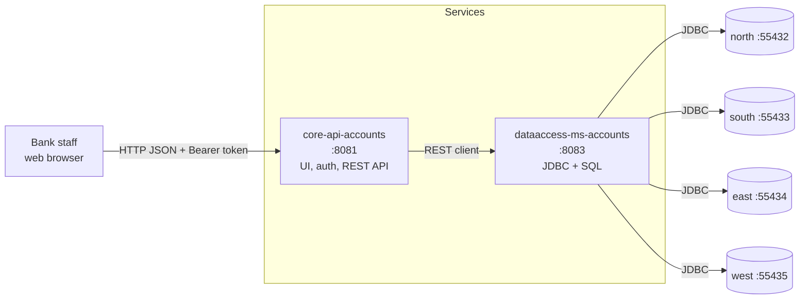
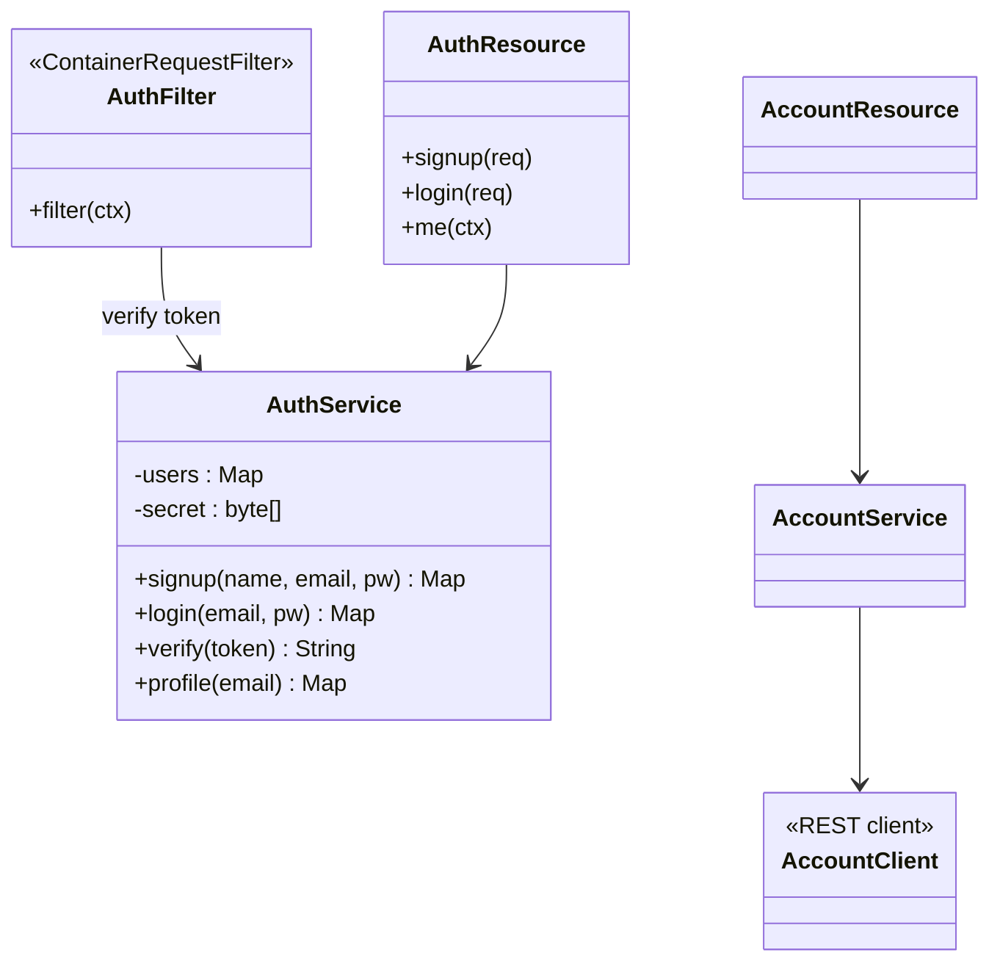
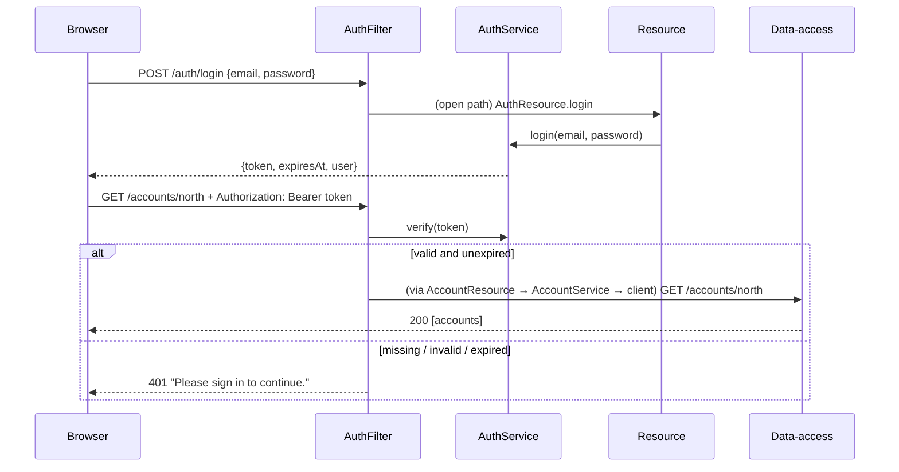
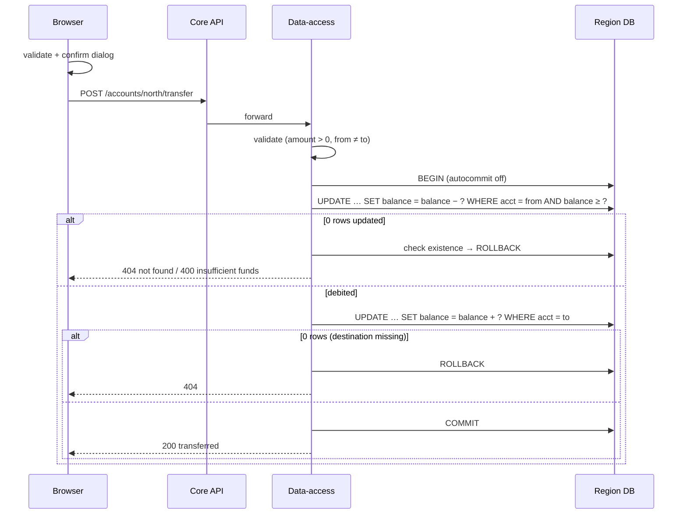
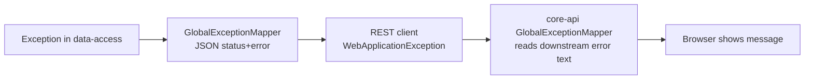
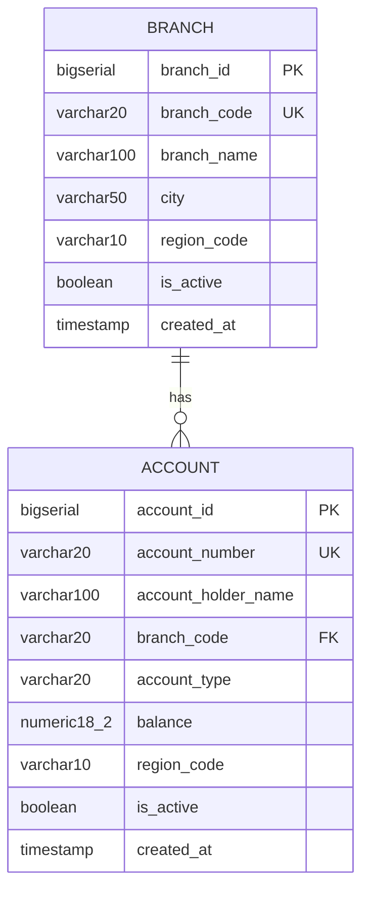
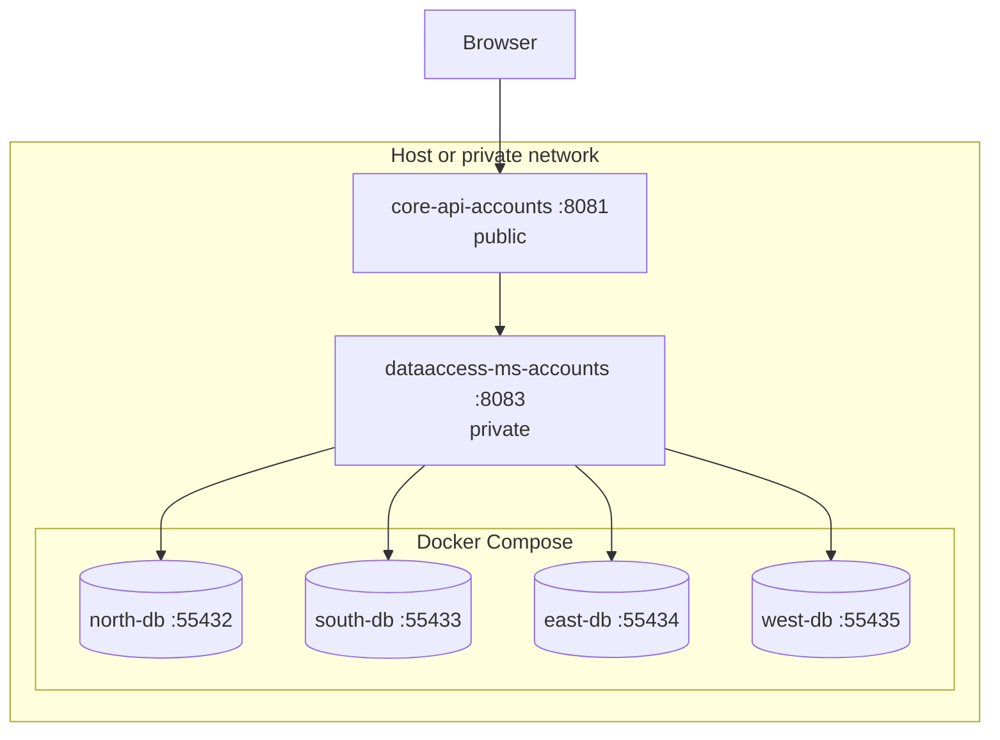

# Software Design Specification (SDS)

**Product:** Mera Apna Bank — regional digital banking platform
**Version:** 1.0 &nbsp;|&nbsp; **Date:** 2026-09-25
**Implements:** [SRS](SRS.md) v1.0 (requirement IDs are cited as *FR-…* / *NFR-…*)

Diagrams use [Mermaid](https://mermaid.js.org/), which GitHub and VS Code render.

---

## 1. Introduction

This document explains how Mera Apna Bank is designed: its architecture,
components, data model, main interactions, security design and the reasons
behind key decisions. It is for developers who will maintain or extend the
system. For what the system must do, see the SRS; for day-to-day use, the
[Quick Guide](quick-guide.md).

## 2. Architectural overview

### 2.1 Context and containers



### 2.2 Key design decisions

| Decision | Reason |
|----------|--------|
| **Two services** — a public *core API* and a private *data-access* service | Keeps SQL and database credentials out of the public tier; the core API stays a thin, easily-secured layer. |
| **One database per region** | Data isolation per region; a region can be scaled, backed up or moved independently (CON-TECH-002). |
| **Region in the URL, not the data** | The data-access service picks the datasource from `{region}`, so a request can only ever touch one region's database. |
| **Plain JDBC, small query builder** | Full control over SQL and transactions without an ORM (CON-TECH-003). |
| **Stateless signed tokens** | No server-side session store; the core API scales horizontally as long as instances share the secret and user store. |
| **Vanilla HTML/CSS/JS UI** | No build step; a single static file served by Quarkus (CON-TECH-004). |
| **Auth built on the JDK** | Signup/login with zero extra dependencies; easy to replace with OIDC/JWT later. |

### 2.3 Technology stack

| Layer | Technology |
|-------|------------|
| Language / runtime | Java 17+ |
| Framework | Quarkus 3.39 — Jakarta REST, MicroProfile REST Client, ArC (CDI), SmallRye OpenAPI |
| Data access | Agroal pooling, PostgreSQL JDBC driver |
| Database | PostgreSQL 16 (Docker, one container per region) |
| Frontend | HTML, CSS, JavaScript; Montserrat (Google Fonts); Three.js r160 (bundled) |
| Build | Maven (wrapper included) |

## 3. Component design

### 3.1 core-api-accounts

```
com.teresol.meraapnabank
├── auth/        AuthFilter · AuthResource · AuthService
├── resource/    BranchResource · AccountResource        (HTTP endpoints)
├── service/     BranchService · AccountService          (pass-through logic)
├── client/      BranchClient · AccountClient            (REST clients → :8083)
├── dto/         *Dto, New*Request, Update*Request, AmountRequest, TransferRequest
└── exception/   GlobalExceptionMapper                   (uniform JSON errors)
```



- **AuthFilter** — runs before every request; protects `/accounts*`, `/branches*` and `/auth/me` (FR-AUTH-007). Stores the authenticated email on the request.
- **Resources** — map HTTP to service calls; no business logic.
- **Services / Clients** — forward calls to the data-access service; the REST client relays its status and message.
- **GlobalExceptionMapper** — turns any exception into `{"status", "error"}` JSON, and surfaces the downstream service's message instead of a generic client error (NFR-REL-002).

### 3.2 dataaccess-ms-accounts

```
com.teresol.meraapnabank
├── BranchResource · AccountResource    endpoints + SQL
├── Datasources                         region → Agroal datasource
├── RegionType                          NORTH/SOUTH/EAST/WEST, parse(), codePrefix()
├── GlobalExceptionMapper
├── *Dto, *Request
└── util/  Table · Selection · Tables · QueryBuilder   simple SELECT/INSERT/UPDATE/DELETE
```

- **RegionType.parse** validates the region (`400` if unknown) and gives the code prefix (`NO`, `SO`, `EA`, `WE`) used to validate branch codes and account numbers (FR-BR-003, FR-AC-003).
- **Datasources** returns the connection pool for a region; there is no way to query two regions in one call.
- **QueryBuilder** builds parameterised equality-based statements. Anything needing richer conditions (deposit, withdraw, transfer) uses hand-written `PreparedStatement`s (NFR-SEC-004).

### 3.3 Web UI

A single page (`index.html`) with a login overlay and four views. Main
functions: `callApi` (adds the token, handles `401`), `switchView`,
`submitAuth`/`enterApp`/`logout`, per-feature load/create/update/delete
functions, `requireFields`/`requireAmount` (validation), `askConfirm`
(modal), `createScene` (Three.js), `fmtMoney`, `esc` (HTML escaping). Details
in [frontend.md](frontend.md).

## 4. Interaction design

### 4.1 Login and an authenticated request (FR-AUTH-004, 007)



### 4.2 Transfer (FR-TX-006, NFR-REL-001)



The withdrawal is a *conditional update* (`balance >= ?`), so the balance check
and the debit are one atomic statement — two concurrent withdrawals cannot
both succeed on the same funds (FR-TX-003).

### 4.3 Error handling



Status codes used: `400` invalid input, `401` not authenticated, `404` not
found, `409` conflict, `500` unexpected.

## 5. Data design

### 5.1 Schema (identical in each regional database)



- `account.branch_code` references `branch.branch_code`, so a branch with accounts cannot be deleted (`409`) and an account needs an existing branch.
- Money uses `NUMERIC(18,2)` in the database and `BigDecimal` in Java — no floating-point rounding.
- Regions are separate databases, so there are no cross-region foreign keys; a transfer is limited to one region.
- Seed data is in `dataaccess-ms-accounts/db/<region>-init.sql`.

### 5.2 User store (core API)

`users.json`, keyed by lower-cased email:
`{ "fullName", "email", "salt", "hash" }`. Held in memory (a `ConcurrentHashMap`)
and written on every signup. Signup is `synchronized` to prevent duplicate
registrations.

### 5.3 Region code convention

| Region | Prefix | Branch example | Account example |
|--------|--------|----------------|-----------------|
| NORTH | NO | NO-001 | NO-AC-0001 |
| SOUTH | SO | SO-001 | SO-AC-0001 |
| EAST | EA | EA-001 | EA-AC-0001 |
| WEST | WE | WE-001 | WE-AC-0001 |

## 6. Interface design

### 6.1 REST API summary

| Area | Method & path | Auth |
|------|---------------|------|
| Auth | `POST /auth/signup`, `POST /auth/login` | none |
| Auth | `GET /auth/me` | bearer |
| Branches | `GET /branches/{region}`, `POST /branches`, `PUT /branches/{region}/{code}`, `DELETE /branches/{region}/{code}` | bearer |
| Accounts | `GET /accounts/{region}`, `POST /accounts`, `PUT /accounts/{region}/{number}`, `DELETE /accounts/{region}/{number}` | bearer |
| Transactions | `POST /accounts/{region}/{number}/deposit`, `…/withdraw`, `POST /accounts/{region}/transfer` | bearer |
| Docs | `GET /q/openapi`, `/q/swagger-ui` (dev) | none |

Request and response bodies are in the [main README](../README.md#api-overview).

### 6.2 Configuration (core API)

| Key | Default |
|-----|---------|
| `quarkus.http.port` | `8081` |
| `branch-data-access/mp-rest/url` | `http://localhost:8083` |
| `auth.secret` (`AUTH_SECRET`) | random per start |
| `auth.users-file` (`AUTH_USERS_FILE`) | `users.json` |
| `auth.token-ttl-seconds` | `28800` |

## 7. Security design

| Threat | Mitigation | Req. |
|--------|------------|------|
| Stolen password database | PBKDF2-HMAC-SHA256, 120,000 iterations, random 16-byte salt per user | FR-AUTH-006, NFR-SEC-001 |
| Timing attack to discover registered emails | Login hashes the supplied password even when the email is unknown; hashes are compared in constant time | NFR-SEC-002 |
| Forged or edited token | HMAC-SHA256 signature over the payload; any change fails verification | FR-AUTH-009 |
| Stolen token | Expires after 8 h (configurable); use HTTPS in production | FR-AUTH-008 |
| Unauthenticated API use | `AuthFilter` on all banking routes | FR-AUTH-007 |
| SQL injection | Parameterised statements only | NFR-SEC-004 |
| Cross-site scripting | API data is HTML-escaped before rendering (`esc()`) | FR-UI-007 |
| Direct access to the data tier | Data-access service has no auth → keep it on a private network | NFR-SEC-005 |
| Overdraft race | Conditional `UPDATE … AND balance >= ?` inside a transaction | FR-TX-003 |

Full authentication design: [authentication.md](authentication.md).

## 8. Deployment design



- Development: `docker compose up -d`, then `./mvnw quarkus:dev` in each service.
- Production-style: `./mvnw package` produces `target/quarkus-app/quarkus-run.jar` (Dockerfiles for JVM and native are in `core-api-accounts/src/main/docker/`). Set `AUTH_SECRET`, terminate TLS in front of port 8081, and firewall 8083 and the database ports.

## 9. Design limitations and future work

| Item | Suggested improvement |
|------|-----------------------|
| Single role for all users | Add roles (teller, manager, admin) and check them in `AuthFilter` |
| Users in `users.json` | Move to a database table; add password reset and email verification |
| No login throttling | Add per-IP / per-account rate limiting and lockout |
| Data tier unauthenticated | Add service-to-service auth (mTLS or a shared token) |
| No transaction history | Add a `transaction` table per region and a statement view |
| Account error mapping | Map FK/unique violations to `400`/`409` and zero-row updates to `404` (see SRS Appendix C) |
| No automated integration tests | Add Quarkus tests with Testcontainers PostgreSQL |
| Cross-region transfers | Would need a saga/outbox pattern; deliberately out of scope |
